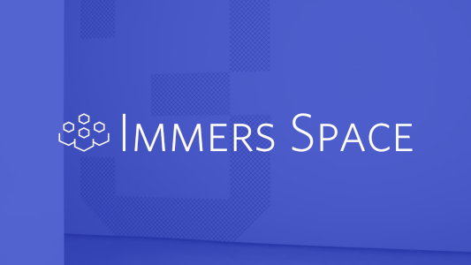

# immers-client

Client library to connect with Immers servers and Immers Space accounts from the Immersive Web.
Using the Immers Client, you can enhance your site with social features and let your users
share your site with their friends. Immers Space is a federated social network, so you're
not casting in with any one company or community, you're enabling users from any number of
communities to bring their accounts, identities, and friends with them to your Immersive
Web experience. [Check out our FAQ for Immersive Web content creators](https://web.immers.space/immersive-web-creators-frequently-asked-questions/).

View the full API documentation at
[https://immers-space.github.io/immers-client](https://immers-space.github.io/immers-client)

# Features

| Feature | Description |
| --- | --- |
| **Easy to use** | High-level APIs abstract away the complex details of ActivityPub and federated social networks |
| **Social login without tracking** | Makes **no** network requests unless a user opts to log in |
| **Lightweight** | Tree-shakable, few dependencies, 100 Kb bundle |
| **Promote your site** | Immersers share your site with their friends when they login |

## High-level APIs

Immers Space is based on the ActivityPub W3C standard for federated social media, but you
don't need to know any of the details of activity streams to use Immers Space with our 
high-level APIs

### The one-liner

You can add the ability for users to login with their Immers Space accounts and invite their
friends to visit your site with just a single line of code.
[See this live on our documentation pages](https://immers-space.github.io/immers-client).

```html
<script src="https://unpkg.com/immers-client/dist/destination.bundle.js">
```

This will add the `<immers-hud>` Web Component floating on the bottom left of your page,
giving users a GUI to login to their account which will then share your page with all
of their friends. You can also customize it by adding the following query parameters
to the end of the script `src`.

| Parameter | Description | Default |
| --- | --- | --- |
| position | Overlay position, one of `bottom-left`, `top-left`, `bottom-right`, `top-right`, `none` | `bottom-left` |
| title | Name of your site to use when sharing | `document.title` |
| role | Level of access to request (user can change before accepting, one of `public`, `friends`, `modAdditive`, `modFull` | `friends` |

If you do not want the `<immers-hud>` element to be automatically injected,
you can add your own `<immers-hud>` anywhere in the document or set the position to `none`.

### immers-hud Web Component

Adds an unobtrusive, 32px square icon than can be clicked to open a small GUI that allows for
OAuth2 authorization with any Immers Server via a pop-up window. Once connected,
you'll have access to the users's profile to customize your experience with their preferred identity
and all of their friends will be sent a link to your site.

### ImmersClient class

Connect to user accounts from any Immers Server to access user profiles and enable social features. 

## Low-level APIs

For advanced work, you can dip down into the low-level APIs and start
crafting and sending your own activities

### Activities

Create and retrieve Activities, the unit of communication in federated social networks

### ImmersSocket

Live streaming updates from a users home server let them know when friends come online or send messages.

## State of this library

This library is under active development, the current functionality allows users to login
and see a live count of how many of their friends are online. You will be able to access their
profile to get display name and preferred avatar (image and gltf). Additional features
like metaverse-wide chat and collectible avatars are available in the low-level APIs
but not yet integrated into the high-level APIs or the `<immers-hud>` GUI
